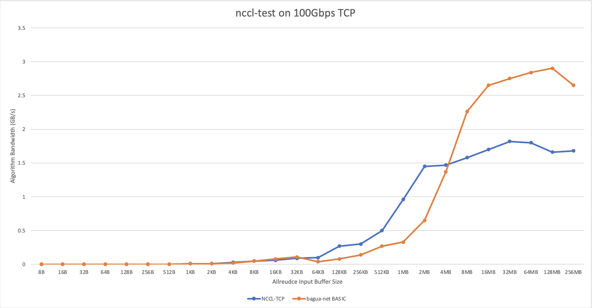
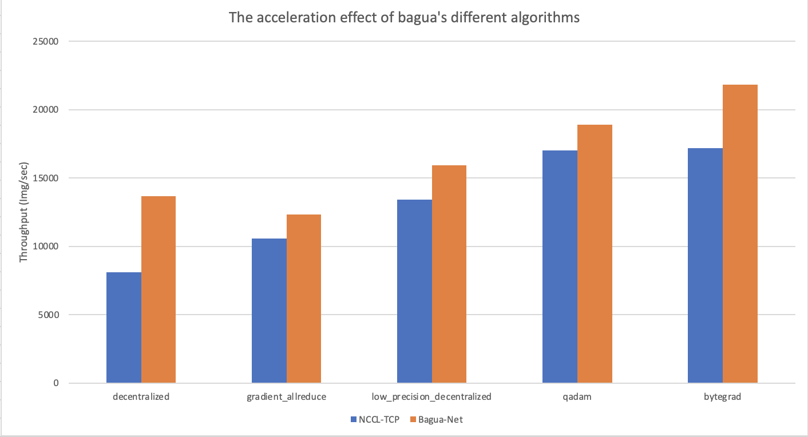

# Bagua-Net

In order to further optimize the communication performance, improve the efficiency of NCCL on a specific network. We provide the NCCL plug-in bagua-net.

We found that under a 100G TCP network, some of the throughput bound model training efficiency is not good, and the bandwidth utilization rate is low. For example, the 100G bandwidth utilization rate of VGG16 in a 32 V100 environment is only about 36%. In talk with the NCCL, I found that fairness between streams will restrict bandwidth utilization. So we developed this plug-in bagua-net to solve this problem.

The actual effect is good. The bandwidth utilization of [the above example](https://github.com/BaguaSys/examples/blob/main/benchmark/synthetic_benchmark.py) can be increased to 83%, and the throughput can be increased by 30%+:

```
# VGG16 on 4x8xV100 Bagua-Net
Running benchmark...
Iter #0: 4081.0 img/sec GPU
Iter #1: 4072.0 img/sec GPU
Iter #2: 4106.4 img/sec GPU
Iter #3: 4081.7 img/sec GPU
Iter #4: 4064.8 img/sec GPU
Iter #5: 4122.1 img/sec GPU
Iter #6: 3857.7 img/sec GPU
Iter #7: 4128.3 img/sec GPU
Iter #8: 4125.5 img/sec GPU
Iter #9: 3826.6 img/sec GPU
Img/sec per GPU: 126.5 +-6.4
Total img/sec on 32 GPU(s): 4046.6 +-205.2

# VGG16 on 4x8xV100 NCCL-TCP
Running benchmark...
Iter #0: 2620.2 img/sec GPU
Iter #1: 2771.9 img/sec GPU
Iter #2: 2772.6 img/sec GPU
Iter #3: 2794.5 img/sec GPU
Iter #4: 2627.9 img/sec GPU
Iter #5: 2787.8 img/sec GPU
Iter #6: 2775.9 img/sec GPU
Iter #7: 2741.6 img/sec GPU
Iter #8: 2760.0 img/sec GPU
Iter #9: 2796.6 img/sec GPU
Img/sec per GPU: 85.8 +-3.8
Total img/sec on 32 GPU(s): 2744.9 +-122.3
```

## Some test results

### 1. Performance comparison of Bagua-Net and NCCL-TCP under 100G TCP network



Thanks to the tensor fusion of the communication library. The actual communication packets will be larger than 10MB. In this range, Bagua-Net has better performance than NCCL-TCP. I have also done some experiments. When training a small network, Bagua-Net is no worse than NCCL-TCP.

### 2. Bagua-Net's acceleration effect on Bagua's different algorithms



> The data comes from the real 128 V100 ImageNet training.
