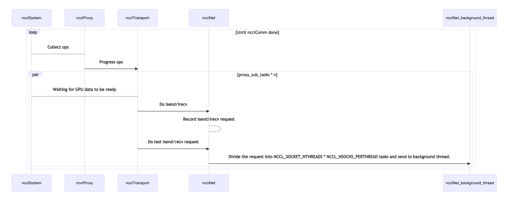

## What NCCL-plugin is?

NCCL plugin is a network communication primitive plug-in provided by NCCL. Users can implement the NCCL plugin dynamic link library (libnccl-net.so) to replace the underlying network communication of NCCL.

The plugin template is as follows:

```c
// .. Some declarations

typedef struct {
  // Name of the network (mainly for logs)
  const char* name;
  // Initialize the network.
  ncclResult_t (*init)(ncclDebugLogger_t logFunction);
  // Return the number of adapters.
  ncclResult_t (*devices)(int* ndev);
  // Get various device properties.
  ncclResult_t (*getProperties)(int dev, ncclNetProperties_v4_t* props);
  // Create a receiving object and provide a handle to connect to it. The
  // handle can be up to NCCL_NET_HANDLE_MAXSIZE bytes and will be exchanged
  // between ranks to create a connection.
  ncclResult_t (*listen)(int dev, void* handle, void** listenComm);
  // Connect to a handle and return a sending comm object for that peer.
  ncclResult_t (*connect)(int dev, void* handle, void** sendComm);
  // Finalize connection establishment after remote peer has called connectHandle
  ncclResult_t (*accept)(void* listenComm, void** recvComm);
  // Register/Deregister memory. Comm can be either a sendComm or a recvComm.
  // Type is either NCCL_PTR_HOST or NCCL_PTR_CUDA.
  ncclResult_t (*regMr)(void* comm, void* data, int size, int type, void** mhandle);
  ncclResult_t (*deregMr)(void* comm, void* mhandle);
  // Asynchronous send to a peer.
  // May return request == NULL if the call cannot be performed (or would block)
  ncclResult_t (*isend)(void* sendComm, void* data, int size, void* mhandle, void** request);
  // Asynchronous recv from a peer.
  // May return request == NULL if the call cannot be performed (or would block)
  ncclResult_t (*irecv)(void* recvComm, void* data, int size, void* mhandle, void** request);
  // Perform a flush/fence to make sure all data received with NCCL_PTR_CUDA is
  // visible to the GPU
  ncclResult_t (*iflush)(void* recvComm, void* data, int size, void* mhandle, void** request);
  // Test whether a request is complete. If size is not NULL, it returns the
  // number of bytes sent/received.
  ncclResult_t (*test)(void* request, int* done, int* size);
  // Close and free send/recv comm objects
  ncclResult_t (*closeSend)(void* sendComm);
  ncclResult_t (*closeRecv)(void* recvComm);
  ncclResult_t (*closeListen)(void* listenComm);
} ncclNet_v4_t;

typedef ncclNet_v4_t ncclNet_t;

#define NCCL_PLUGIN_SYMBOL ncclNetPlugin_v4

// .. Collnet declarations
```

> The code snip only intercepts the network communication protocol, [the complete code is here](https://github.com/NVIDIA/nccl/blob/master/src/include/nccl_net.h).

If you want to write a NCCL-plugin yourself, you can refer to [the official implementation](https://github.com/NVIDIA/nccl/tree/master/ext-net/dummy) to do it.

## Other things you want to know about NCCL-plugin

### 1. NCCL-plugin and native implementation of NCCL

Protocol template ncclNet_t is a general template for NCCL internal network communication. NCCL's own RDMA and TCP communication also implement this set of interfaces. NCCL will initialize NCCL plugin, RDMA and TCP in order, and use the first successful initialization as the network communication method.

Simplified execution process is as follows:

 - GetUniqueId
   - ncclInit
 - ncclInit
   - initEnv: In addition to environment variables, the configuration will be read from ~/.nccl.conf /etc/nccl.conf
   - initGdrCopy: Initialize GPU direct read
   - initNet
     - bootstrapNetInit: Initialize the NCCL boot program to generate NCCL unqiue ID
     - initNetPlugin: Load libnccl-net.so
     - initNet: Initialize the network primitives. There are currently three implementations [plugin, rdma, tcp], and they are used in order of priority.
     - initCollNet: Initialize collnet, collnet is a new algorithm in NCCL that allows GPUs on multiple nodes to do in-network reductions. Implementation is optional. Official explanation: [What is CollNet?](https://github.com/NVIDIA/nccl/issues/320)


### 2. Simplified diagram of NCCL-plugin works


