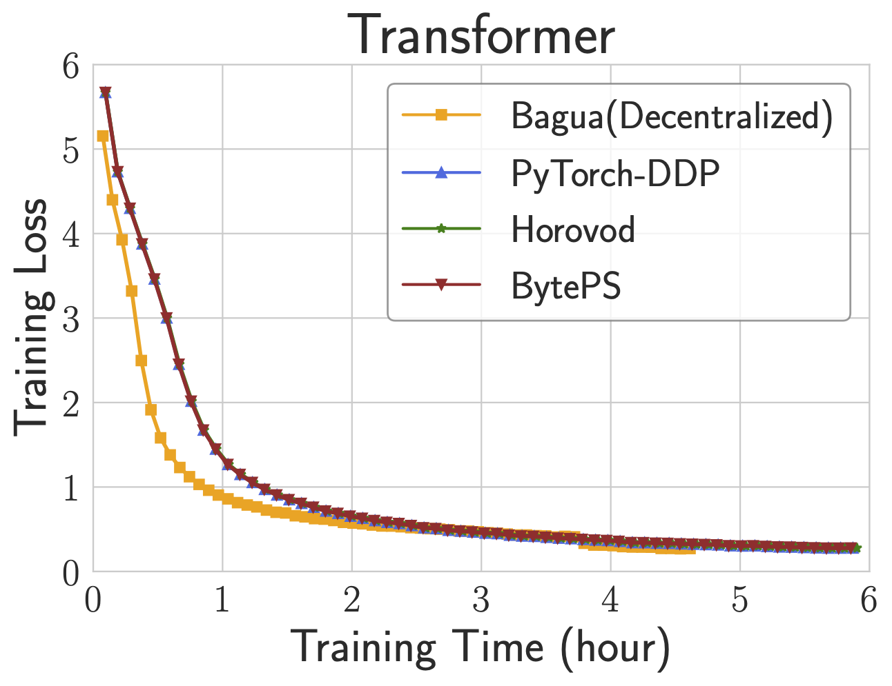
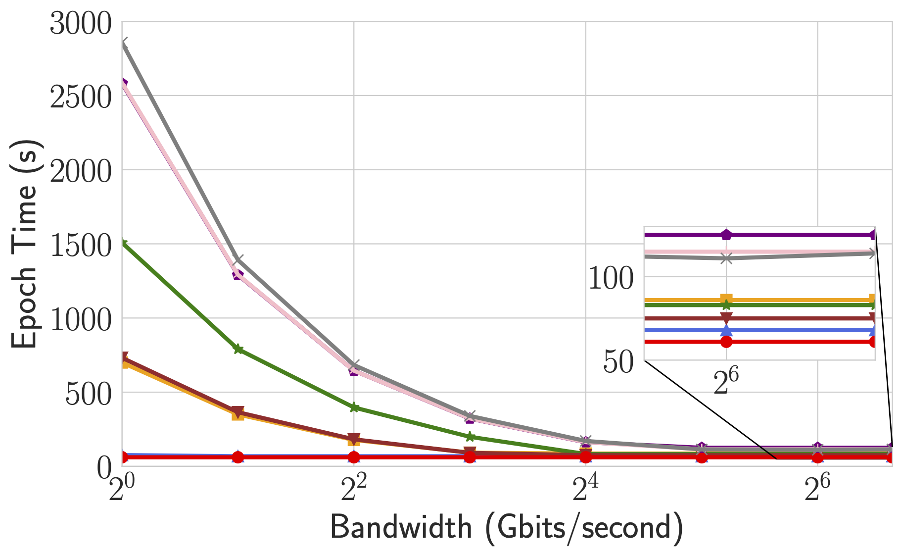

# Benchmark

## Setup

We use up to 16 servers for benchmarks, each of which is equipped with 8 NVIDIA V100 32GB GPUs interconnected by NVLink. Servers are connected by 100 Gbps TCP/IP network. We compare the performance of Bagua with Horovod, PyTorch-DDP and BytePS on various tasks, including vision task (VGG16 on ImageNet), NLP task (BERT-Large finetune on SQuAD), and speech task (Transformer on AISHELL-2).

## End-to-end performance

    

The figure above demonstrates the end-to-end training performance of three tasks. For each task, we select the best algorithm (according to the training efficiency and accuracy) from Bagua to compare with other systems. We use up to 128 GPUs (on 16 servers) to train three tasks:
- VGG16 on ImageNet with 128 GPUs; batch size per GPU: 32; Bagua algorithm: ByteGrad.
- BERT-Large Finetune on SQuAD with 128 GPUs; batch size per GPU: 6; Bagua algorithm: QAdam 1-bit.
- Transformer on AISHELL-2 with 64 GPUs; batch size per GPU: 32; Bagua algorithm: Decentralized.

## Scalability

VGG16 is known as a task that is difficult to scale because of its high ratio of communication and computation.

<!-- This figure shows the scalability of four systems on VGG16 with up to 128 GPUs. We can see that Bagua achieves obviously higher scaling efficiency than other systems.

    

 -->

The following figure shows the training throughput for VGG16 on ImageNet with 128 GPUs under different network bandwidth. It also lists the performance of different built-in algorithms in Bagua.

    

Results show that Bagua can achieve multiple times of speedup compared with other systems.

## Trade-off of algorithms regarding network conditions

By supporting a diverse collection of algorithms, Bagua provides users the flexibility to choose algorithms for different tasks and network conditions (in terms of latency and bandwidth). To understand behaviors of these algorithms under different network conditions, we manually change the bandwidth and latency of connections between servers and report the epoch time accordingly.

      
    <figcaption>Epoch time of BERT-Large Finetune under different network conditions</figcaption>

This figure shows the epoch time of Bagua (with three algorithms) and other systems when the bandwidth has been changed from 100 Gbps to 1 Gbps, and the latency has been changed up to 5 ms. As we can see, when the interconnections are slower than the fast network that we previously adopted, Bagua can provide even more significant performance boost over the existing systems. Specifically, when the bandwidth is low, algorithms that require less amount of data transmission (e.g., QAdam, ByteGrad) outperform others. When the latency is getting high, algorithms that require fewer connections (e.g., decentralized SGD) tend to be degraded less than other methods. If we keep increasing the latency, we can observe that the decentralized SGD outperforms all others.

