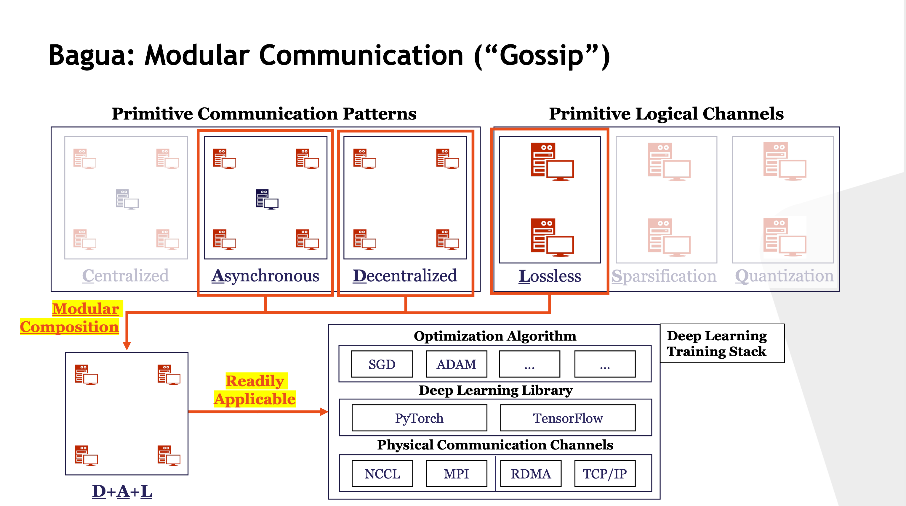

# Introduction

Bagua is a self-developed GPU distributed training communication framework developed by Kuaishou technology. It aims to provide a system abstraction that is both flexible and modular to support state-of-the-art system relaxation techniques of distributed training which has integrated **allreduce algorithm**, **decentralized algorithm**, **asynchronous communication**, **quantitative communication** and other technologies. Its effectiveness has been verified in various scenarios including VGG-16 and ResNet-50 on ImageNet, Bert Large on SQuAD and multiple business applications in our company. Powered by the new system design, Bagua has a great ability to implement and extend various state-of-the-art distributed learning algorithms. In a production cluster with up to 16 machines (128 GPUs), Bagua can outperform PyTorch-DDP, Horovod and BytePS in the end-to-end training time by a significant margin (up to **1.95×**) across a diverse range of tasks. Its main architecture is shown as below:

Compared with the industry's open source framework Horovod, PyTorch DDP, and Byteps, we made two technical contributions.

1. Our first contribution is the system design of Bagua, which provides a <u>modular design for communications</u>. Our abstraction goes beyond parameter server and Allreduce paradigms, and provides a collection of MPI-tyle collective operations to facilitate communications with different precision and centralization strategies. This abstraction is flexible and modular enough to support many algorithms. Moreover, we also develop a simple automatic optimization framework that speeds up algorithms implemented within the Bagua framework. The key behind this framework is automatic batching and scheduling of communications. Different from previous work such as Horovod and BytePS, our optimization framework can be applied more widely beyond the standard stochastic gradient (SG) based algorithm.

2. Our second contribution is an extensive empirical study centered around two hypotheses: (1) By supporting different system relaxation techniques, Bagua is able to <u>provide significant improvement for real-world applications and workloads with real-world infrastructure over existing systems</u>; and (2) By supporting a diverse range of system relaxations, Bagua is able to <u>provide a scalable ML training over a diverse network conditions</u> to allow a user picking different algorithms. To this end, we conduct a large-scale empirical study with both benchmark tasks and real-world applications running at Kwai Inc. Moreover, we conduct a rigorous tradeoff exploration showing that different algorithms and system relaxations achieve best performance over different network conditions. This illustrates the importance of providing this diverse cohort of algorithms to an end user.

