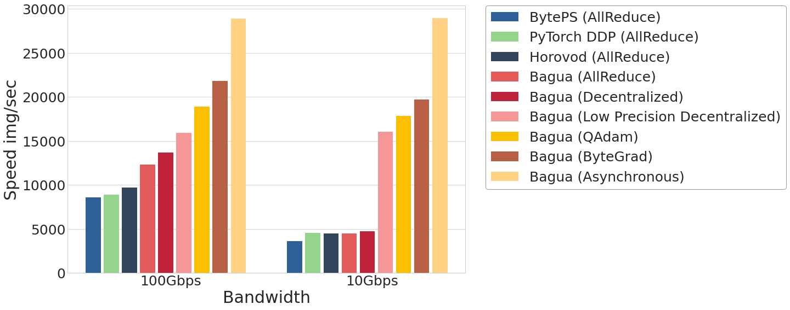
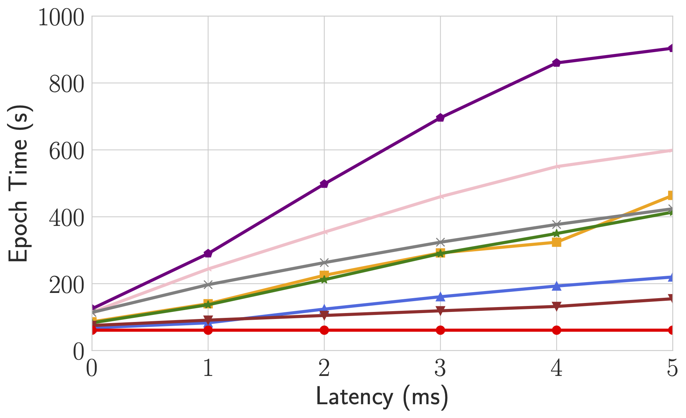

# Introduction

Bagua is a deep learning training acceleration framework for PyTorch developed by [AI platform@Kuaishou Technology](https://www.kuaishou.com/en) and [DS3 Lab@ETH](https://ds3lab.inf.ethz.ch/). Bagua currently supports:

- **Advanced Distributed Training Algorithms**: Users can extend the training on a single GPU to multi-GPUs (may across multiple machines) by simply adding a few lines of code (optionally in [elastic mode](https://bagua-tutorials.kwai-seattle.com/elastic-training/)). One prominent feature of Bagua is to provide a flexible system abstraction that supports state-of-the-art system relaxation techniques of distributed training. So far, Bagua has integrated communication primitives including
  - Centralized Synchronous Communication (e.g. [Gradient AllReduce](https://bagua-tutorials.kwai-seattle.com/algorithms/gradient-allreduce))
  - Decentralized Synchronous Communication (e.g. [Decentralized SGD](https://bagua-tutorials.kwai-seattle.com/algorithms/decentralized))
  - Low Precision Communication (e.g. [ByteGrad](https://bagua-tutorials.kwai-seattle.com/algorithms/bytegrad))
  - Asynchronous Communication (e.g. [Async Model Average](https://bagua-tutorials.kwai-seattle.com/algorithms/async-model-average))
- [**TCP Communication Acceleration (Bagua-Net)**](./more-optimizations/bagua-net.md): Bagua-Net is a low level communication acceleration feature provided by Bagua. It can greatly improve the throughput of AllReduce on TCP network. You can enable Bagua-Net optimization on any distributed training job that uses NCCL to do GPU communication (this includes PyTorch-DDP, Horovod, DeepSpeed, and more).
- [**Performance Autotuning**](https://bagua-tutorials.kwai-seattle.com/performance-autotuning/): Bagua can automatically tune system parameters to achieve the highest throughput.
- [**Generic Fused Optimizer**](https://bagua.readthedocs.io/en/latest/autoapi/bagua/torch_api/contrib/fused_optimizer/index.html): Bagua provides generic fused optimizer which improve the performance of optimizers by fusing the optimizer `.step()` operation on multiple layers. It can be applied to arbitrary PyTorch optimizer, in contrast to [NVIDIA Apex](https://nvidia.github.io/apex/optimizers.html)'s approach, where only some specific optimizers are implemented.
- [**Load Balanced Data Loader**](https://bagua.readthedocs.io/en/latest/autoapi/bagua/torch_api/contrib/load_balancing_data_loader/index.html): When the computation complexity of samples in training data are different, for example in NLP and speech tasks, where each sample have different lengths, distributed training throughput can be greatly improved by using Bagua's load balanced data loader, which distributes samples in a way that each worker's workload are similar.

Its effectiveness has been validated in various scenarios and models, including VGG and ResNet on ImageNet, Bert Large, and multiple huge scale industrial applications at Kuaishou such as 

- the recommendation system supporting model training with dozens of TB parameters,
- video/image understanding with >1 billion images/videos,
- ASR with TB level datasets,
- etc.

## Performance

<!-- <center>
    
    <figcaption>The scalability of different systems on VGG16 with up to 128 GPUs.</figcaption>
</center>

<br/>
<br/> -->

<center>
     
    <figcaption>The performance of different systems and algorithms in Bagua on VGG16 with 128 GPUs and different network bandwidth.</figcaption> 
</center>

<br/>
<br/>

<center>
    
    <figcaption>Epoch time of BERT-Large Finetune under different network conditions for different systems.</figcaption>
</center>

For more comprehensive and up to date results, refer to [Bagua benchmark page](benchmark/index.html).

## Cite Bagua

```bibtex
@misc{gan2021bagua,
      title={BAGUA: Scaling up Distributed Learning with System Relaxations}, 
      author={Shaoduo Gan and Xiangru Lian and Rui Wang and Jianbin Chang and Chengjun Liu and Hongmei Shi and Shengzhuo Zhang and Xianghong Li and Tengxu Sun and Jiawei Jiang and Binhang Yuan and Sen Yang and Ji Liu and Ce Zhang},
      year={2021},
      eprint={2107.01499},
      archivePrefix={arXiv},
      primaryClass={cs.LG}
}
```

## Links

* [Bagua Github](https://github.com/BaguaSys/bagua)
* [Bagua Examples](https://github.com/BaguaSys/bagua/tree/master/examples)
* [Bagua Tutorials](https://bagua-tutorials.kwai-seattle.com/)
* [Bagua API Documentation](https://bagua.readthedocs.io/)
