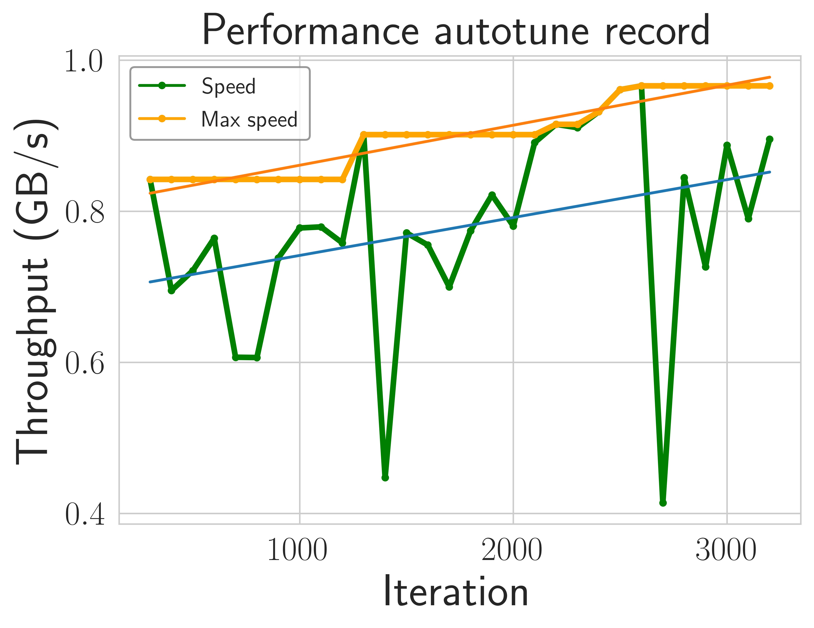

# Performance Autotuning

Bagua comes with several adjustable hyperparameters for communication that can affect runtime performance. For example tensor fusion bucket size.

Determining the best combination of these hyperparameters to maximize system performance can be a process of a lot of trial-and-error, as many factors including model complexity, network bandwidth, and GPU hardware can all affect the best parameter to choose.

Bagua provides a mechanism to automate this process of choosing the best values for these hyperparameters. The Bagua autotuning system uses Bayesian optimization to efficiently search through the space of hyperparameters. This feature can be enabled by providing the `--autotune_level 1` flag to `bagua.distributed.run`:

```bash
python -m bagua.distributed.run --nproc_per_node ... --autotune_level 1 python train.py
```

The main process of autotune is simple. The autotune system finds $N$ groups of hyperparameters through Bayesian optimization, and the hyperparameters are brought into the training to verify the performance, each group of hyperparameters takes $T$ seconds to verify. 

Generally speaking, the larger the $N$ is, the larger the search space, and the more likely it is to find the best hyperparameters. The larger the $T$, the more accurate the measurement of the group of hyperparameters' performance.

In addition, the autotune system skips the first $W$ seconds to warmup.

You can adjust $N$ with the `--autotune_max_samples` flag and adjust $T$ with the `--autotune_sampling_confidence_time` flag, adjust $W$ with the `--autotune_warmup_time`.

## Debugging

With turn on the `--is_output_autotune_log` option, autotune system will dump the tuning process to a logfile, the logfile name format is `/tmp/bagua_autotune_${RANDOM_STR}.log`

The file is csv format, each row is the hyperparameters and scoring of one round of iteration:

```csv
bucket_size_2p,is_hierarchical_reduce,score,train_iter
23,False,1.4117491757441083,300
15,True,1.1258082798810858,400
29,True,1.0463204022477832,500
```

`bucket_size_2p` is the power of 2 of the bucket size, for example `bucket_size_2p=23` means bucket_size is 8388608 bytes ($2^{23}$).

## Case study

For example, on a popular speech recognition task (aishell2), training with autotune increased the throughput by 8.26%.

<center>
    
    <figcaption>Training performance improvement during the hyperparameter tuning process.</figcaption>
</center>

This figure shows the gradual increase in training performance during tuning. In
this experiment, the hyperparameters are changed approximately every 100
iterations. The x-axis is the number of iterations. The y-axis is the data
throughput.
