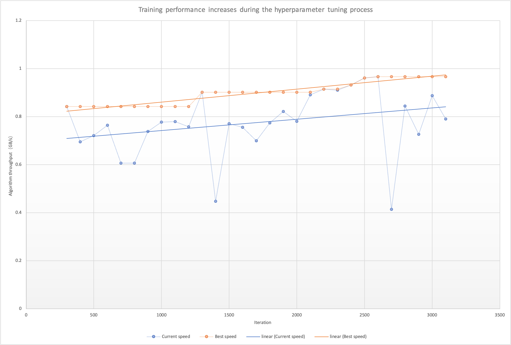

# Performance Autotuning

Bagua comes with several adjustable hyperparameters for communication that can affect runtime performance. For example tensor fusion bucket size.

Determining the best combination of these hyperparameters to maximize system performance can be a process of a lot of trial-and-error, as many factors including model complexity, network bandwidth, and GPU hardware can all affect the best parameter to choose.

Bagua provides a mechanism to automate this process of choosing the best values for these hyperparameters. The Bagua autotuning system uses Bayesian optimization to efficiently search through the space of hyperparameters. This feature can be enabled by providing the `--autotune_level=1` flag to `bagua.distributed.run`:

```bash
python -m bagua.distributed.run --nproc_per_node ... --auotune_level=1 python train.py
```

The main process of autotune is simple. The autotune system finds $N$ groups of hyperparameters through Bayesian optimization, and the hyperparameters are brought into the training to verify the performance, each group of hyperparameters takes $T$ seconds to verify. 

Generally speaking, the larger the $N$ is, the larger the search space, and the more likely it is to find the best hyperparameters. The larger the $T$, the more accurate the measurement of the group of hyperparameters' performance.

In addition, the autotune system skips the first $W$ seconds to warmup.

You can adjust $N$ with the `--autotune_max_samples` flag and adjust $T$ with the `--autotune_sampling_confidence_time` flag, adjust $W$ with the `--autotune_warmup_time`.

## Debugging

The autotuning system dumps the tuning process in a file. The file path is specified by the parameter `--autotune_logfile`, and the default value is `/tmp/bagua_autotune.log`.

The file format is csv, each row is the hyperparameters and scoring of a round of iteration:

```csv
bucket_size_2p,is_hierarchical_reduce,score,train_iter
23,False,1.4117491757441083,300
15,True,1.1258082798810858,400
29,True,1.0463204022477832,500
```

`bucket_size_2p` is the power of 2 of the bucket size, for example `bucket_size_2p=23` means bucket_size is 8388608 bytes ($2^{23}$).

## Case study

We applied autotune to real tasks. In a speech recognition task called aishell2, the training with autotune increased the throughput by 8.26% compared to the default mode.

You can intuitively feel the performance improvement during the training process through the following figure:



The bagua autotune logfile used to generate the above figure:

```csv
bucket_size_2p,is_hierarchical_reduce,score,train_iter
23,False,0.8420762677055301,300
11,True,0.6950127238143395,400
14,True,0.7212985074838149,500
29,True,0.7642746491151714,600
19,False,0.606655147638381,700
20,False,0.606278593323977,800
23,False,0.7379234445494159,900
20,True,0.7777836780473603,1000
18,True,0.7792166478756608,1100
30,False,0.7579933040354122,1200
25,False,0.9013195445719159,1300
26,False,0.4472218525939399,1400
31,True,0.7712800448958087,1500
31,True,0.7552010132254972,1600
10,True,0.6998075255900524,1700
31,True,0.7740177656734211,1800
31,True,0.8215428764739477,1900
31,True,0.7803780289900614,2000
25,False,0.8907986383998597,2100
25,False,0.9149670115173865,2200
25,False,0.910533066120079,2300
25,False,0.9315674656878257,2400
25,False,0.9608873168050996,2500
25,False,0.9659173207807134,2600
25,False,0.4140020507078227,2700
24,False,0.8442255268054354,2800
22,False,0.7262396897551101,2900
25,False,0.8871842881946423,3000
30,True,0.79003354386501,3100
25,False,0.8952864802203675,3200
17,True,0.7699847166558618,3300
25,True,0.8838409167793653,3400
16,False,0.6430481782486221,3500
25,True,0.8661155629048857,3600
28,False,0.7875855584088112,3700
...
```

Observing the log, we can see that compared to the default 10MB bucket, a relatively larger bucket can help the system achieve better performance.

> NOTE: score is algorithm throught, approximately equal to the data throughput GB/s of each process of the training system
